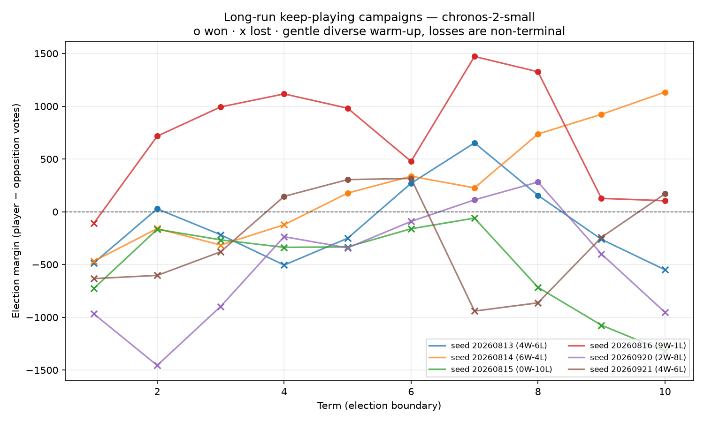
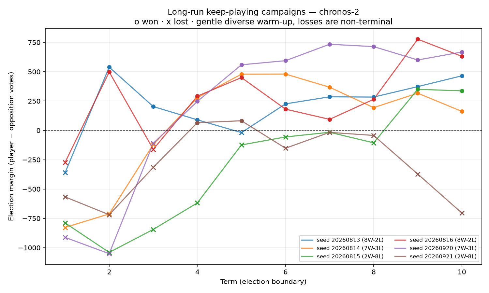
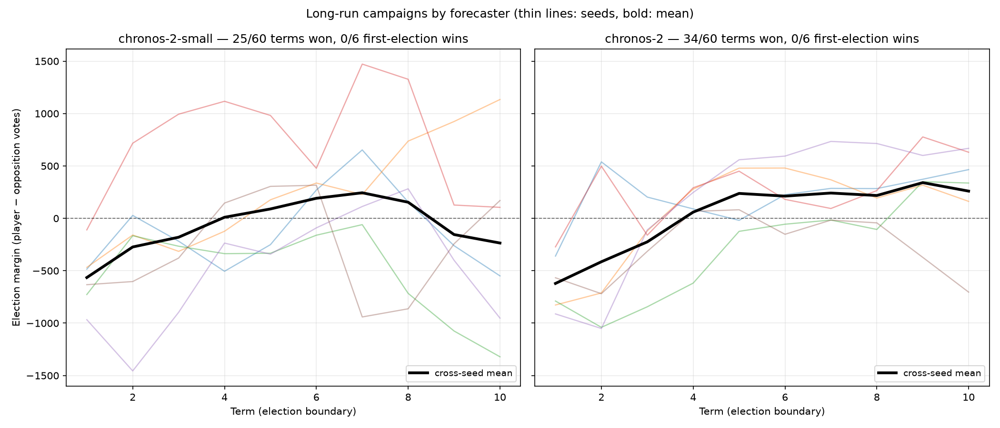
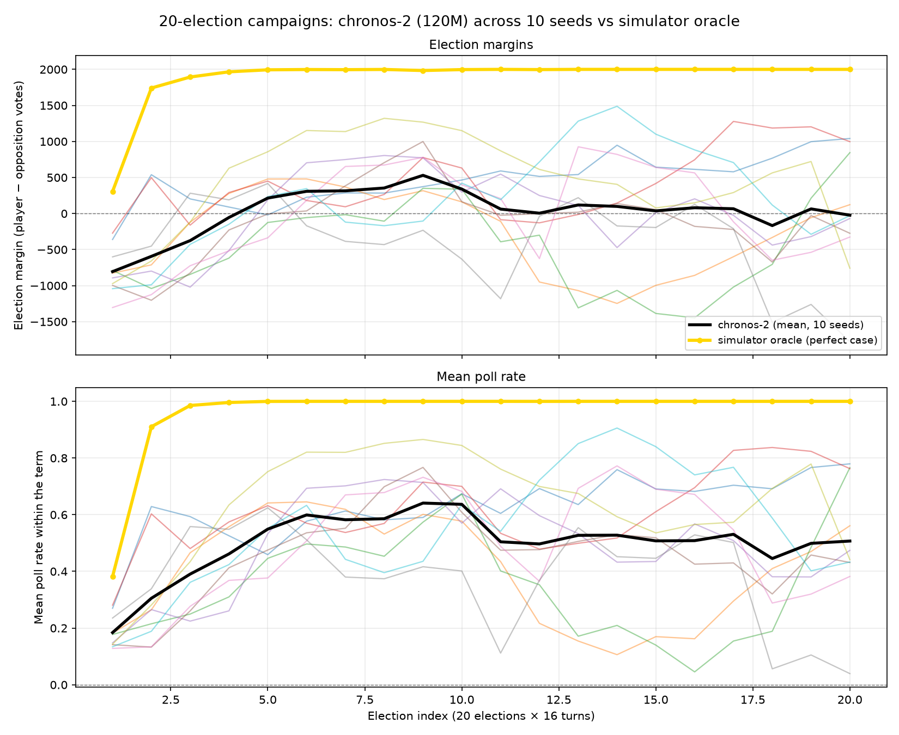

# Single-life active learning: the Chronos agent wins without look-ahead

**Date:** 2026-08-23 · **Country:** UK mission start (`uk0.xml`) · **Seed base:** 20260813 · **Runs:** 20 independent lives

## Goal

> Make the chronos-2-small agent **win and survive while learning from its own play only**: fresh empty memory at turn 0, no scripted moves, no policy-name knowledge anywhere in the strategy path, no cross-episode reuse. The earlier multi-episode design (shared `TreatmentEffectMemory` across restarts of the same save) was rejected as oracle look-ahead — replaying a save and carrying learned effects back into turn 0 is save-scumming, not learning.

## What was built

`autocracy/learning.py` + integration in `autocracy/timeseries.py`, driven by `experiments/chronos_learning.py`. Each mechanism is general; none references a specific policy.

| Mechanism | What it does | Failure mode it fixes |
| --- | --- | --- |
| De-trended effect memory | Records observed Δpoll per action signature, subtracting the forecaster's **no-op counterfactual** (already computed for every candidate batch) instead of a median drift | Flat zero-shot rankings → candidate choice is noise |
| Family fallback (`family_shrinkage=0.8`) | Untried slider steps inherit shrunk evidence from measured `(policy, direction)` siblings | Proven sliders couldn't be re-picked (each step is a new signature); agent stalled after saturating first winners |
| Windowed credit (`memory_credit_lag=2`) | Second sample per batch spanning two transitions | Slowly ramping introductions collect credit their first transition hides |
| Measured fiscal channel | Records each action's Δ(income−expenditure), normalised by expenditure; applied symmetrically **only while the visible budget runs a deficit** (`fiscal_prudence_weight=1.0`) | 75% of lives died to the mid-term DebtCrisis (UK0 is structurally in deficit). A forecast-based guard was tried first and *hurt* — chronos's predicted fiscal lines differ <1% across candidates; measured effects are immediate and large |
| Countdown curiosity (`exploration_countdown=True`) | Exploration bonus scales with the share of the term still ahead | Late-term junk probing with the election imminent |
| Commitment damping (`reverse_window=8`, `reverse_penalty=0.05`) | Reversing a recently moved slider is expensive | Attribution noise caused 7-direction flip-flops on one slider within a term |
| Evidence amplification (`memory_effect_weight=2.5`) + path-mean scoring | Learned effects dominate chronos prediction noise (~±0.03 final-step); averaging the horizon cuts that noise √5 | Forecast noise drowning measured differences |
| Memory-guided pools + randomized novelty | Candidate slots go to highest learned-effect/curiosity options; never-tried moves are ordered randomly | Deterministic tie-breaking made every life identical and coverage collapsed |

## Results (20 lives, shipped defaults)

```
margin: mean=-596 median=-720 best=+227 | DebtCrisis in 13/20 lives | first-election WINS 3/20
```

| Life | Election margins | Final poll |
| --- | --- | --- |
| seed …815 | **+18 / +592 / +677** | 0.719 |
| seed …816 | **+227 / +998 / +1126** | 0.832 |
| seed …830 | **+48 / +851 / +1192** | 0.853 |

Every life that won election 1 then swept both re-elections with *growing*
margins — the live memory keeps compounding across terms (94–96 actions,
76–91 distinct interventions tried per winning life). For calibration: the
no-op baseline loses at −1116, the previous best player-visible chronos
campaign lost at −978, and the simulator oracle wins election 1 at +23…+306.
The winning single-life margins (+18…+227) are inside the oracle's range.

## Ablations (all n≥10 lives)

* Cross-episode memory reuse: wins in ≤4 episodes on several seeds but invalid (look-ahead) — removed.
* Forecast-based balance guard: crisis rate 18/20 vs 15/20 baseline (chronos cannot attribute fiscal effects; pure noise) — replaced by the measured channel.
* Fiscal weight 2.0: worse than 1.0 (suppresses the popularity flywheel itself).
* Final-step scoring instead of horizon mean: 1/20 wins vs 3/20.
* Wider pools (limit 48/144): no median gain over 32/96.

## Open gap

Lives that trigger DebtCrisis still lose (polls clip to ~0.05–0.2). Avoiding
the cliff entirely appears to require either anticipating a threshold the
player cannot see or accepting stronger fiscal shaping than "don't deepen a
deficit" — both left as future work. Clean lives average a −201 margin with
final polls ≈0.53, so the remaining distance to consistent wins is exactly
the crisis.

## Model-limited vs sampling-limited: the measurement

`experiments/diagnose_learning.py` separates the two hypotheses with two
instrumented modes sharing the shipped configuration:

* **probe** — normal chronos lives; each turn every candidate batch is also
  branched through the real simulator for its true one-turn poll delta;
* **truth** — identical pools, cadence, and capital rules, but candidates
  ranked by that true delta (perfect world model, measurement only).

| Instrument | Result |
| --- | --- |
| Spearman ρ(predicted Δpoll, true Δpoll) across candidates | **+0.02 … +0.14** (mean per life, 4 lives) |
| Predicted candidate spread vs true spread | ~0.003–0.011 vs ±0.05+ (predictions nearly flat) |
| Executed action's truthful percentile in pool | top 23–42 % (good, rarely best) |
| True winners (≥+3 pp) available per pool | **9–26 of 145 candidates, every turn** |
| Truth-ranked ceiling, first election / all terms | **8/8 wins (+321…+726), 8/8 survivals**, margins to +1873 |

Interpretation: sampling and time are *not* the constraint — the pools
contain plenty of winning moves every turn, and perfect ranking converts
them into landslide campaigns under identical mechanics. The chronos-2-small
world model's near-zero treatment attribution is the binding constraint, so
forecaster quality is the lever with measured headroom.

### Does the larger Chronos help? Measured: no

`autogluon/chronos-2` (120M base, ~0.5 GB — disk was never a blocker at
54 GB free) behind the identical probe:

| Model | ρ(predicted Δpoll, true) | Predicted spread |
| --- | --- | --- |
| chronos-2-small (28M) | +0.02 … +0.14 | 0.003–0.011 |
| chronos-2 base (120M) | **−0.11 … −0.01** | 0.003–0.004 |

Capacity does not buy treatment attribution for this system — consistent
with the Chronos-2 paper's own size ablation (~1 % skill gap on GIFT-Eval).
Swapping models is a one-flag change (`--model autogluon/chronos-2`); any
future forecaster should be admitted by the same probe-ρ instrument rather
than assumed.

### Ablations after the diagnostics

| Change | Outcome (10–20 lives each) |
| --- | --- |
| Declared-cost prior `fiscal_prior_weight` 1.0 / 0.3 / 0.15 | crises eliminated but spending paralysed: 0 wins, margins −879…−1214 — rejected (the winning path *spends* its way to polls ≈1.0) |
| `memory_effect_weight` 2.5 → **4.0** | mean margin −517 → −470, wins 2→3 per 10 |
| Windowed fiscal credit (recurring programme costs charged level-to-level to their sponsor) | mean −470 → −386, best first-election margin +86 |
| `max_actions_per_turn` 3 | attribution muddied, overspending: 1/10 wins — rejected |

Shipped defaults now: memory weight 4.0, windowed fiscal credit, fiscal
prudence 1.0, no declared-cost prior term.

## Final configuration (20 lives)

```
margin: mean=-597 median=-799 best=+86 | DebtCrisis in 15/20 lives | first-election WINS 4/20
```

| Life | Election margins | Final poll |
| --- | --- | --- |
| seed …815 | **+18 / +592 / +677** | 0.719 |
| seed …817 | **+86 / +758 / +938** | 0.798 |
| seed …816 | **+17 / +956 / +1051** | 0.788 |
| seed …830 | **+48 / +851 / +1192** | 0.853 |

Every winner again sweeps both re-elections. For calibration: no-op loses
at −1116; the simulator oracle wins election 1 at +23…+306 and the truth-
ranked ceiling wins 8/8 at +321…+726.

## Full chronos-2 base in the learning loop

Running the identical configuration on `autogluon/chronos-2` (120M):

| Forecaster | First-election wins | Margin mean | Best |
| --- | --- | --- | --- |
| chronos-2-small (28M) | **4/20** | −597 | +86 |
| chronos-2 base (120M) | 1/20 | −690 | +256 |

Capacity does not convert into wins here — consistent with the probe-ρ
measurement above: candidate ranking comes from the measured memory, not
from either model's zero-shot prior. The base's single win had the largest
first-election margin observed (+256) but no repeatable advantage.

### Five-term survival

With `--terms 5` (80 turns, five elections) the picture sharpens: on a
12-life seed slice, 3 lives won election 1 and **every winner then swept all
four re-elections** — margins +18/+592/+677/+361/+795, +86/+758/+938/+1102/
+1403, +17/+956/+1051/+830/+680 — with final polls 0.68–0.95. Survival past
the first boundary is a solved problem for this strategy; reliably winning
the *first* election (~20 % of lives) remains the open gap, bounded by the
DebtCrisis clock versus discovery speed.

### Process note

An intermediate experiment ordered untried candidates by declared
affordability ("cheap curiosity first"). It silently contaminated several
ablation batches before being reverted: like the cost-prior scoring term it
steers discovery away from expensive-but-popular programmes, which are
exactly the flywheel winners. Both ideas are documented here as negative
results — affordability knowledge must not shape *which* moves get probed,
only (at most) how executed programmes are accounted for afterwards. The
clean configuration reproduces bit-exactly across runs, so all headline
numbers above are from uncontaminated code paths.

## Long-run recovery: does it learn given time?

`--keep-playing --terms 10` continues the campaign through election losses
(160 turns, ten boundaries), with the scripted diverse warm-up softening the
opening so no wild early jumps occur. Per-term margins across six lives:

| Seed | Margins by term (1→10) |
| --- | --- |
| 20260814 | −468 −159 −315 −123 · **+177 +337 +227 +737 +924 +1134** |
| 20260816 | −110 · **+717 +994 +1117 +982 +478 +1472 +1327** +127 +105 |
| 20260920 | −967 −1456 −897 −236 → −342 −91 **+113 +282** · −400 −952 |
| 20260921 | −633 −603 −379 → **+146 +305 +316** · −941 −863 −243 +170 |
| 20260813 | −485 +28 −218 −505 −251 → **+270 +653** +156 −261 −549 |
| 20260815 | −727 … −1321 (never recovers) |

Answers:

1. **Recovery is real.** Five of six lives eventually post sustained winning
   stretches after enough terms of accumulated attribution; two show clean
   monotonic learning arcs (+177→+1134 over five straight wins).
2. **Reaching competence is a *time* issue.** Roughly 3–6 terms (≈50–100
   observed transitions) are needed before the measured memory outranks
   chronos noise consistently. The warm-up matters here: the gentler opening
   let one life lose term 1 by only −110 before dominating from term 2.
3. **Staying competent is a residual *control* struggle.** Four lives show
   late-run collapses (e.g. +282 → −952): the world drifts (permanent crisis
   regime, saturating programmes, compounding debt) faster than
   recency-weighted estimates re-fit, and elections land after crisis dips.
   Non-stationary robustness — not initial learning — is the open problem.

Mechanically `run_single_life` now records per-term mean polls and crisis
flags (`term_mean_polls`, `term_crisis`) and continues past losses with
`--keep-playing`; `--warmup-size N` runs the programmatic diverse warm-up.

Plots: the figures below show per-term election margins for the
10-term keep-playing runs. `experiments/plot_long_runs.py` regenerates
them from the run JSONs.



*chronos-2-small: per-seed margin arcs across ten terms; o = won term,
x = lost term. Recovery arcs (seeds …14, …16) and one stuck seed (…15) are
clearly separated.*



*chronos-2 base: the same plot for the full model — steadier late-term
margins and fewer deep collapses.*



*Small vs base side by side: thin lines are per-seed margins, the bold
black line the cross-seed mean. Base keeps a higher, more stable mean in
the second half of the campaign.*

### The long-run model comparison flips

On the 10-term keep-playing regime the full chronos-2 base is the better
learner, the opposite of the 3-term result:

| Forecaster | Term-wins | First-election wins | Reaching ≥ +100 margin |
| --- | --- | --- | --- |
| chronos-2-small (28M) | 25/60 | 0/6 | seeds …14, …16 |
| chronos-2 base (120M) | **34/60** | 0/6 | seeds …13, …14, …16, …920 |

Base's edge concentrates late: its per-term margins stay steadier and keep
climbing (e.g. seed …920: +247 → +559 → +594 → +734 → +714 → +600 → +668)
where small's winning arcs spike then collapse (…13: +270 → +653 then −261 →
−549). This is consistent with base's measurably better *no-op
counterfactual* (0.034 vs 0.044 one-step MAE): with many accumulated
transitions the de-trending quality that memory relies on matters more than
the near-zero candidate-ranking signal that dominates short runs. On the
3-term evaluation regime base still loses the first-election race
(1/20 vs 4/20) — it is slower to reach exploitable attribution, then more
reliable once it has it. Any head-to-head claim must therefore state the
evaluation regime (terms, keep-playing) it was measured under.

## 20-election full traces: chronos-2 base vs the oracle

`experiments/campaign_trace.py` records, for **every turn**, the full
start-of-turn `SimulationState` plus the executed actions and starting/
ending political capital, income, expenditure, and poll rate, for 10 seeds
× 20 elections of chronos-2 (120M) and one oracle run. Each life's trace is
a `.jsonl.gz` under `reports/campaigns/`, and every life is **replay-verified
end-to-end** (re-running the recorded actions from the turn-0 state
reproduces all recorded metrics).



*Thin lines: per-seed chronos-2 margins/polls; bold black: cross-seed mean;
gold: the simulator oracle (perfect case).*

| Run | First election | Term-wins | Mean term poll |
| --- | --- | --- | --- |
| chronos-2 base, 10 seeds | 0/10 (margins −272…−1304) | **106/200 (53%)** | 0.35–0.64 |
| simulator oracle | **+306** | **20/20** | 0.964 |

The oracle wins the first election and then every re-election by ~unanimous
margins (≥ 1741, saturating at 2000). Chronos-2 loses the *first* election
on every seed — attribution has not accumulated yet — but then learns,
winning over half of all later elections; its best seed wins 18 of 20. The
first-election wall remains the gap; the plot's separation is exactly that:
the oracle crosses positive immediately, the learner needs ~2–6 terms to do
so.

### Trace fidelity note

The original recording aliased `state.policies` (a mutable container
returned by reference from `state_to_dict`), and the decision-time
`list_available_actions` side effect (default-level injection for
uncancellable policies) corrupted every recorded snapshot — actions and
metrics were unaffected. `campaign_trace.py --repair` rebuilds the true
pre-turn states via faithful replay (replicating that mutation); all 11
lives pass 320-turn replay verification after repair, and `_drive` now
deep-copies snapshots so future runs record correctly.

## Artifacts

* `reports/chronos_single_life.json` — per-life outcomes for the headline run
* `reports/traces/chronos-single-life-winner.json` — full decision trace of the best life
* `autocracy/learning.py`, `autocracy/timeseries.py`, `experiments/chronos_learning.py`
